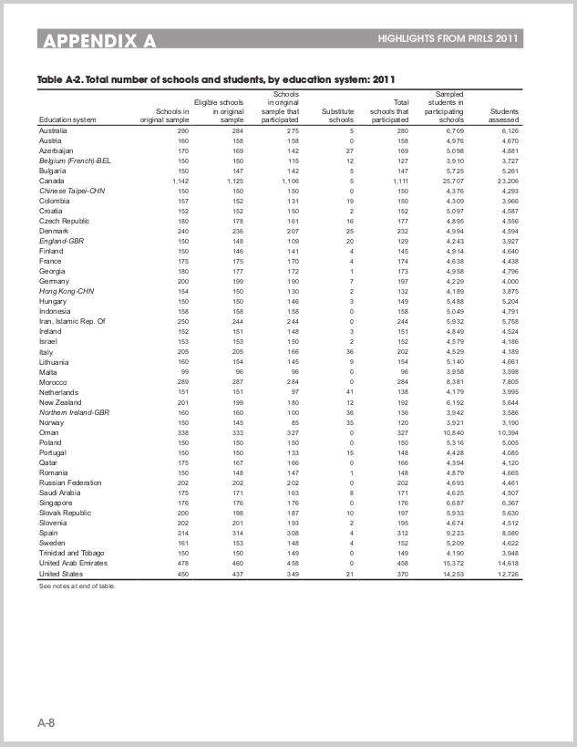
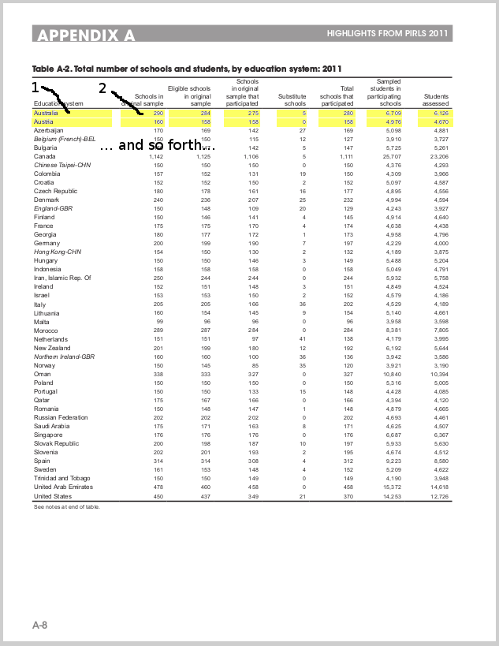

# Problem

Find bounding boxes for table cells that do not have visible borders.

As an example, see a page from [us-020.pdf](samples/us-020.pdf):

After running a detection, these individual values need to be identified, as highlighted in yellow:

These yellow cells should be represented in the following JSON format:

    [{
        "width": 100, "top": 300, "height": 10, "left": 25
    }, {
        "width": 70, "top": 300, "height": 10, "left": 135
    }, /* ...and 8 more that correspond to "Australia" */,
    /* ...and then 10 that correspond to "Austria", and so forth */]

...where the first object is 1, and the second is 2 on the image.

Note that for the same row the value "top" is the same. Cells in the same row may or may not have the same height.

I have another service which works well with cells which are all clearly delimited with vertical and horizontal lines (using a Hough Lines algorithm), but it breaks for anything else, e.g.:

* horizontal lines only
* vertical lines only
* a single border around the entire table

If you can find a generalised solution which works for any "grid-like" thing on a PDF page, all the better.

# Existing code

(*please feel free to throw all of it away if the "rivers" approach is silly*)

The code startswith coordinator.py which accepts a PDF URL and spits out some boxes, with some supporting code in lib.

lib/gridfinder.py gives results as Python dicts.

# Existing approach

The code I provided works for a couple of PDFs, but not for all. It doesn't learn or adapt. It has too many hard-coded values. I take a brute-force approach of finding 'rivers' in-between dilated artefacts on the page - any un-broken rivers must be a column/row delimiter.

I made the decision to involve someone with a better grasp of computer vision before continuing on a possibly-futile path. You guys might know of a much simpler solution using existing algorithms.

# Thoughts

I'm sure 'some' assumptions about PDFs can be made:

* font sizes won't ever be less then N pixels (I haven't determined this value yet, but can it be no smaller than a few pixels, otherwise the text would be illegible)
* no 'single column' tables
* no 'single row' tables
* tables don't always have a header - this is mostly due to tables continuing from the previous page.
* tables can be 'surrounded' by text, either to one side, top/bottom, or a combination of these.
